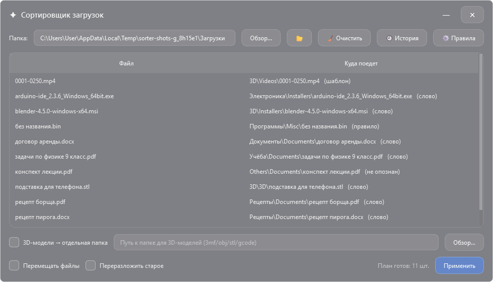
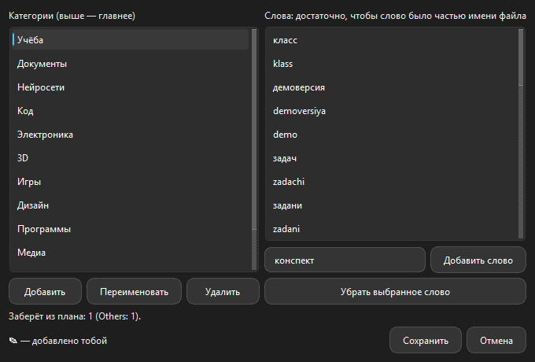

<div align="center">

# Downloads Sorter

**Sorts the Downloads folder into categories and file types without touching other programs' and games' folders. It shows the plan first, moves second, and every move can be undone.**

[Download for Windows](https://github.com/ALEXalesha/SortProgramm/releases/latest) &nbsp;·&nbsp; [Русская версия этого файла](README.ru.md)

[](https://github.com/ALEXalesha/SortProgramm/actions/workflows/ci.yml)
[](https://github.com/ALEXalesha/SortProgramm/releases/latest)
[](LICENSE)



</div>

> **The interface is in Russian**, and so is the long write-up, [README.ru.md](README.ru.md), which this file summarises. In the screenshot, «Куда поедет» is where a file will go, and the note in brackets is why: «слово» (a keyword), «шаблон» (a name pattern), «правило» (a rule set for that exact file).

## What it does

Files go to `Category / Type / file`, for example `Учёба / Documents / задачи.pdf` (study / documents). The category is chosen in a fixed order, and the plan names which step decided it:

0. a rule set for this exact file from the window (right click, "always put into…");
1. hand-written rules for exact names (`overrides.json`);
2. name patterns: a Blender render is called by its frame range (`0001-0250.mp4`), a screenshot by its date, and neither can be caught by a substring;
3. keywords, matched as a substring in the name and, with word boundaries, inside `.txt/.md/.csv` files;
4. the fallback category (`Others`).

Nothing moves until you press Apply, and every run writes an undo log. The History button lists past runs and rolls back the one you pick.

**It only moves what is its own.** An unpacked archive, a Minecraft world, a git repository, a program's folder: without their neighbours those files are rubbish, so such folders are never moved or taken apart. The program walks only the Downloads root and the category folders it created itself.

## Rules from the window

The **⚙ Правила** (Rules) button opens the list of categories and their keywords: add, rename and remove a category, add and remove a keyword. Right click a row of the plan to always put that file into a category. Nobody has to edit JSON by hand any more.



**While you type a keyword, the dialog counts how many files of the current plan it would take and from where.** A greedy keyword is visible before it is saved.

The edits go to **`my_rules.json` next to `config.json`, layered on top of `rules.json`**, not into it. The installer replaces `rules.json` on every update, which is how new categories reach existing installs; an edit written there would last until the next reinstall. `my_rules.json` holds only the differences, so updates still bring new keywords and categories, including into categories you changed. Only what you deleted yourself stays deleted.

The window cannot break the sorting, and this is tested rather than promised: a new or renamed category becomes a folder the program considers its own, the old name stays its own so "re-sort" can still empty it, renaming drags patterns and hand rules along, names are checked the same way the rules file is (paths, forbidden characters, edge spaces, case-insensitive duplicates), and the last category cannot be removed.

## Tests

```bash
pip install -r requirements-dev.txt
python -m pytest
```

674 tests, about 25 seconds, covering the scanner, classifier, patterns, planner, mover, config, history, CLI and both windows.

`tests/test_user_rules_props.py` runs **hypothesis properties** for the rules editor, 150 to 300 random examples each. It builds random program rules and random chains of user actions, successful and refused, with deliberately bad names, and checks the whole contract after every action: no reference to a missing category, every category is a folder of its own, `managed_folders` never shrinks, no keyword lives in two categories, a refused action changes nothing, the file round-trips, edits survive an update of `rules.json`, and a rule for a file beats everything else.

Three things were found on the way, and each by a different tool:

- **A property** caught that removing the last category left no rules at all, and the next start greeted the user with "every file will go to Others". The operation now refuses.
- **A picture of the dialog**, rendered with `QWidget.grab()`, showed "no such files in the plan" for a word that was in the plan; that file simply went to the same category already. The contract held, the text was untrue.
- **Driving the built exe** showed that Enter in the keyword field added the word and also pressed "add category": `QDialog` buttons are `autoDefault`. Tests had added words by calling a method, never by pressing a key. Now a test presses Enter through `QTest`.

`tests/test_properties.py` holds the older properties over random folders, damaged between steps the way real life damages them: a file grows, a second one with the same name arrives, a folder disappears.

## Running it

```bash
pip install -r requirements.txt
python main.py                         # the window
python main.py --path "D:/Downloads"   # console: show the plan only
python main.py --path "D:/Downloads" --apply
python main.py --cli --deep            # re-sort what was sorted before
```

Ready Windows builds, an installer and a portable zip, are on the [releases page](https://github.com/ALEXalesha/SortProgramm/releases/latest). The installer ships no settings of its own: the first start uses your Downloads folder and writes `config.json` itself. The window opens where it was closed and at the same size (`window.json` next to `config.json`); if that monitor is gone, it opens on the one you have.

## Screenshots are generated

`tools/make_screenshots.py` opens the window on an invented Downloads folder in a temporary directory, with the real `rules.json` and none of the author's personal files, and captures the widgets themselves with `QWidget.grab()`. A screen grab would be wrong: a window that just opened can sit behind others, and the shot catches someone else's content.

```bash
python tools\make_screenshots.py
```

## Stack

Python · PyQt6 · pytest · hypothesis · PyInstaller · Inno Setup

## Licence

MIT, see [LICENSE](LICENSE).
